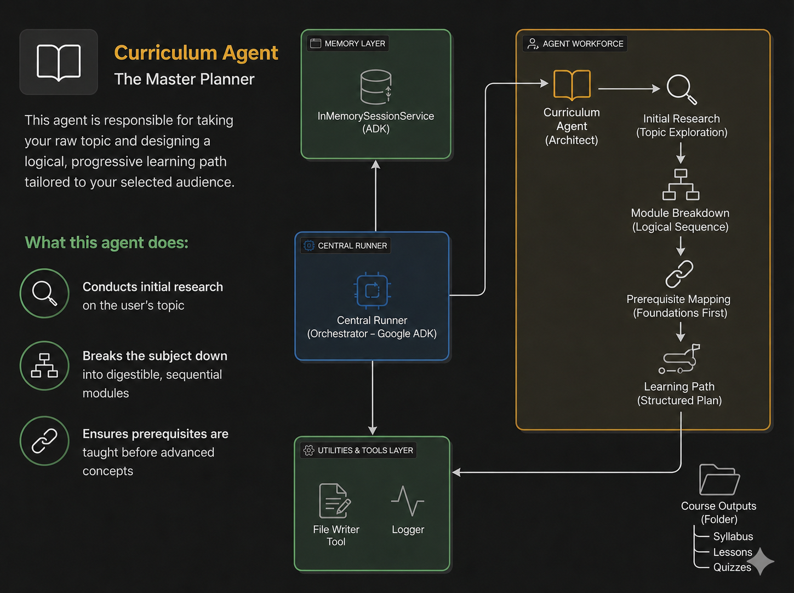
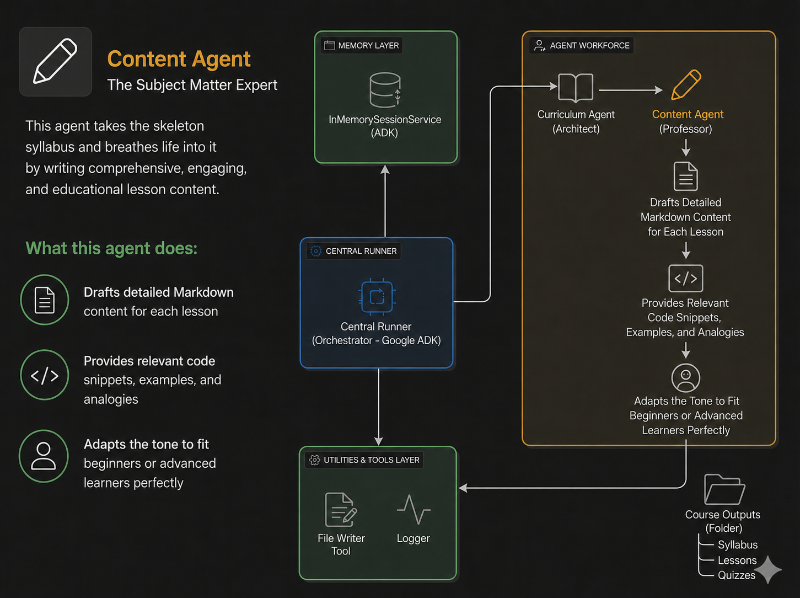
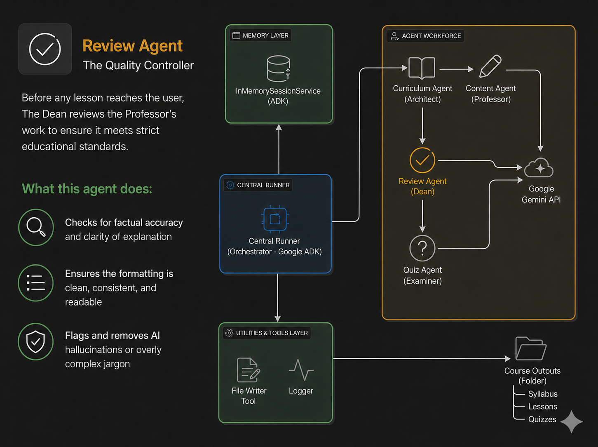
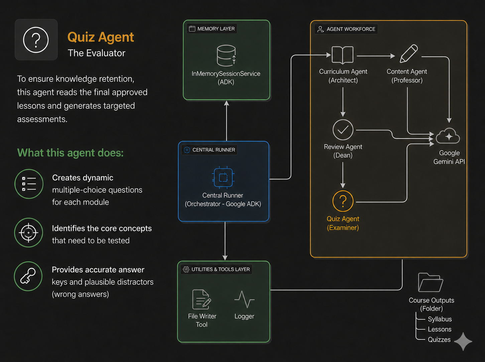

---

```markdown
# EduGenesis: Autonomous AI Course Creator

> **Kaggle "Agents for Good" Track Submission**  
> *Built entirely with Google Antigravity, Google ADK, FastAPI, Supabase & Gemini 2.5 Flash.*  
> **Live Website:** [EduGenesis Platform](https://ai-course-creator-no1b.onrender.com/)

---

## Project Overview


### The Real-World Problem
Access to high-quality, customized education is often a privilege tied to geography and wealth. Private tutoring is prohibitively expensive, and static online courses rarely match a learner's exact needs or current experience level.

While Large Language Models (LLMs) like Gemini or Claude exist, a standard single prompt cannot deliver a comprehensive, properly formatted curriculum in one go. When asked to write an entire course, single models suffer from "persona conflict" and context fatigue—resulting in hallucinations and shallow summaries instead of deep, structured learning.

### The Solution: EduGenesis
EduGenesis is an autonomous **multi-agent system** designed to democratize education. It breaks the content bottleneck by orchestrating a digital workforce of specialized AI agents. By mimicking a human university faculty—with dedicated agents for curriculum planning, technical writing, quality control, and assessment creation—the platform transforms a simple prompt into a high-quality, multi-module course package in a matter of minutes.

---

## Core Concept & Value

### Why Agents?
Instructional design is a multi-step workflow that requires different "modes of thinking." EduGenesis leverages a sequential multi-agent architecture to solve the limitations of standard LLMs:

* **Separation of Concerns:** Just as a university has a separate Professor, Dean, and Exam Board, this system assigns distinct roles to different agents. This ensures the entity creating the lesson is not the same one grading it, eliminating bias and maximizing content density.
* **Iterative Refinement:** The output of one agent (e.g., the Syllabus) becomes the highly structured input for the next (e.g., the Content Writer).
* **Agentic Chunking (Bypassing Token Limits):** Instead of generating a whole course at once, the system loops through individual modules. This completely prevents context fatigue, generating deep-dive content without losing structural quality.

### Key Features
* **Sequential Multi-Agent Workflow:** A strict linear pipeline utilizing a Curriculum Architect, Content Professor, Reviewer (Dean), and Exam Setter.
* **Real-Time SSE Streaming:** Utilizes Server-Sent Events (SSE) via FastAPI to stream agent state changes, pipeline progress, and live markdown text directly to the frontend in real-time.
* **Interactive Assessments:** A custom frontend parser dynamically transforms raw AI JSON/markdown into fully interactive Multiple Choice Quizzes with instant client-side validation and feedback.
* **Cloud-Native Persistence:** Integrates with a **Supabase PostgreSQL** database using an IPv4 Connection Pooler, seamlessly saving generated courses to the user's history ("My Courses" tab).
* **Course Catalog (Explore Topics):** Users can browse and select from pre-defined categories like Tech, AI, Science, Arts, and Commerce to instantly generate tailored learning paths.
* **Export to PDF:** Instantly compile generated markdown courses into beautifully styled, formatted local PDF files for offline usage.
* **Native Google Search Grounding:** The Curriculum Agent uses Google's native search tool to fact-check syllabus topics against real-time data and up-to-date industry standards.

---

## Architecture & Workflow

### Architectural Pipeline


### Data Lifecycle & ER Relationship


### The Agent Workforce

1. **Curriculum Architect**  
   Uses search tools to draft an up-to-date, structured syllabus with targeted objectives.  
   

2. **Content Professor**  
   Takes the validated syllabus structure and writes highly detailed Markdown lessons for each module sequentially.  
   

3. **Review Agent (The Dean)**  
   Evaluates, refines, and formats the professor's draft for pedagogical clarity, tone, and strict design constraints.  
   

4. **Quiz Agent (Exam Setter)**  
   Reads the finalized lesson and generates targeted multiple-choice quizzes to ensure immediate knowledge retention.  
   

---

## Project Structure

```text
AI-COURSE-CREATOR/
├── course_agents/              # AI Agent Definitions
│   ├── content_agent.py        # Professor: Writes detailed lessons
│   ├── curriculum_agent.py     # Architect: Plans the syllabus structure
│   ├── quiz_agent.py           # Examiner: Generates assessments
│   └── review_agent.py         # Dean: Critiques and polishes content
│
├── course_outputs/             # Local storage for generated markdown/PDF courses
├── diagram_folder/             # Architecture diagrams and README assets
│
├── static/                     # Frontend Assets & Web UI
│   ├── partials/               # Reusable HTML components
│   ├── ai_course_creator.html  # Main course generation dashboard
│   ├── explore-topics.js/css   # Interactive course catalog logic & styling
│   ├── login.html              # User authentication UI
│   ├── my-courses.js/css       # Saved course history logic & styling
│   ├── register.html           # User registration UI
│   ├── script.js               # Core SSE streaming and frontend logic
│   └── style.css               # Global application styling
│
├── tools/                      # External Tools for Agents
│   ├── file_writer_tool.py     # Saves agent outputs to local files
│   └── search_tool.py          # Google Search Grounding for syllabus planning
│
├── utils/                      # Helper Utilities
│   ├── gemini_client.py        # Gemini API connection wrapper
│   └── logger.py               # System activity and error logging
│
├── .env                        # Environment variables (API Keys, DB URLs)
├── .gitignore                  # Git tracking exclusions
├── config.py                   # Central system configuration
├── database.py                 # Supabase PostgreSQL / SQLAlchemy ORM setup
├── requirements.txt            # Python package dependencies
└── server.py                   # FastAPI Backend & SSE Pipeline Orchestrator

```

---

## Tech Stack & Tools

* **AI & Orchestration:** Google Agent Development Kit (ADK), Google Gemini API (2.5-Flash).
* **Backend:** Python, FastAPI, Uvicorn, SSE-Starlette.
* **Database & Cloud:** Supabase (PostgreSQL), Render (Hosting).
* **Development Environment:** Google Antigravity.

---

## Local Installation & Setup

### Prerequisites

* Python 3.10+
* Google Gemini API Key
* Supabase PostgreSQL Database URL

### Step-by-Step Setup

**1. Clone the Repository**

```bash
git clone [https://github.com/prasannadolas/course-creator.git](https://github.com/prasannadolas/course-creator.git)
cd course-creator

```

**2. Set Up & Activate Virtual Environment**

*Windows (PowerShell):*

```powershell
python -m venv venv
.\venv\Scripts\Activate

```

*macOS/Linux:*

```bash
python3 -m venv venv
source venv/bin/activate

```

**3. Install Dependencies**

```bash
pip install -r requirements.txt

```

**4. Configure Environment Variables**

Create a `.env` file in the root directory and add your keys:

```text
GEMINI_API_KEY=your_google_api_key_here
DATABASE_URL=your_supabase_ipv4_connection_pooler_url_here
JWT_SECRET_KEY=your_secure_jwt_secret_here

```

**5. Run the FastAPI Server**

```bash
uvicorn server:app --reload

```

*Once booted, access the interactive Course Creator UI at `http://127.0.0.1:8000`.*

---

## Deployment

EduGenesis is optimized for cloud deployment on platforms like **Render**. Ensure your deployment settings match the following parameters:

* **Build Command:** `pip install -r requirements.txt`
* **Start Command:** `uvicorn server:app --host 0.0.0.0 --port $PORT`

The implementation of the Supabase IPv4 Connection Pooler guarantees highly stable, continuous database connections even during multi-minute, complex agent generation cycles.

```

```